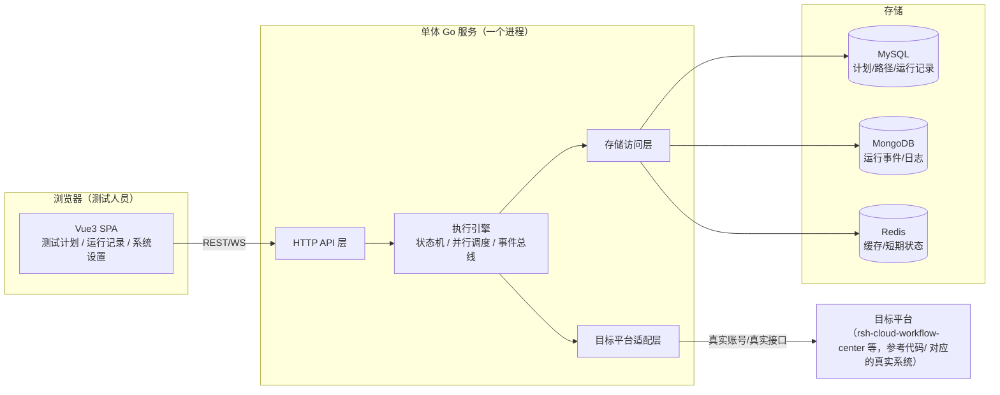

# 架构文档：新项目技术方向

这份文档承接前面三份文档的结论（`00-诊断报告.md` 找到病因，`01-PRD` 定义业务规则，`03-新项目工作方式建议.md` 定义工作方式），把讨论中定下的技术选型落成一份可以直接照着搭骨架的文档。目标读者是你自己，也是接下来负责执行的 agent——它应该先读这份文档，再开始写代码。

## 0. 三条架构原则（贯穿全文，任何新决定都先问这三条）

1. **每加一层复杂度，必须有具体场景逼着非加不可**，不是"未来可能需要"。预判式的复杂度是这次失败的根因。
2. **业务规则只认 `参考代码/`（目标平台真实实现）和 `01-PRD-产品需求真相文档.md`**，代码怎么写、框架怎么选可以变，这两份东西不能绕过。
3. **技术选型定下来之后不再中途换**——尤其是前端框架、组件库这类一换就要重写几十个页面的决定。真要换，必须是一次经过确认的、独立的架构决策，不能在执行任务的过程中被 agent 顺手换掉。

---

## 1. 系统总览



**和 v2 的关键区别**：v2 把这个总览图拆成了 `gateway-nginx / control-api / scheduler-worker / maintenance-worker / target-simulator / form-runtime / logviewer` 七个独立部署单元。这次收回成**一个 Go 二进制进程**，前端是**一个静态资源包**，用 nginx（或直接 Go 内置 `http.FileServer`）托管。没有证据表明现在的使用规模需要独立扩缩容任何一部分，先不拆。

---

## 2. 后端架构

### 2.1 部署形态

一个 Go 服务，`go build` 产出一个二进制，内部通过 goroutine 处理并发调度（串行/并行路径执行），不需要单独的 worker 进程。前端构建产物由同一个服务或一个简单的静态文件服务器托管。

如果确实需要后台定时任务（比如"定时运行"这个业务概念），用进程内的 ticker/cron 实现，不需要单独的 maintenance-worker 服务。

### 2.2 目录分层

v1 的 `internal/` 分层思路本身没问题（这不是上次失败的原因），可以延用结构、重置实现内容：

```
cmd/
  server/            # 唯一入口，main.go
  migrate/           # 数据库迁移 CLI（保留，工具类命令行可以独立）

internal/
  api/               # HTTP handler，只做参数校验和编排调用，不含业务规则
  engine/            # 执行引擎：状态机、并行调度、事件总线、动作执行
  adapter/target/    # 目标平台适配层（见第4节，唯一允许直接对接真实系统的地方）
  analyzer/          # 表单样本、人员样本分析
  builder/           # 表单数据生成
  repository/        # MySQL/Mongo/Redis 访问，不含业务判断
  model/             # 领域类型定义（TestPlan / ExecutionPath / Run / RunItem 等）
  config/            # 配置加载
```

`internal/engine` 的具体实现（状态机怎么转、并行怎么调度）**可以参考 v1 同名目录的写法**——这部分是"怎么写并发和状态机不踩坑"的经验，值得读；但**业务规则（什么时候该转到哪个状态、什么算成功）必须重新对照 `参考代码/` 核实**，不能假设 v1 当年写对了。这条在 `02-资产清单.md` 里已经说过，这里再强调一次因为它直接决定 `internal/engine` 该怎么写。

### 2.3 领域模型命名

`v2/CONTEXT.md`（已废弃，不要参考它的规则）里定义过一套英文实体名：`TestPlan`、`TargetProcess`、`ExecutionPath`、`PathConfiguration`、`Run`、`RunItem`、`TargetAction`、`TargetState`、`ActionResult`、`Reconcile`。这套命名和根目录 `CONTEXT.md`（权威规则来源）里的中文业务术语（计划、执行路径、运行记录、操作账号、安全重试……）是一一对应的，只是英文代码命名和中文产品术语的关系。**命名本身可以沿用**——这不是规则，只是代码里怎么给类型起名字，没有必要重新想一遍。真正要重新核实的是这些实体之间的规则（什么时候能修改、什么算固化），那部分只看根目录 `CONTEXT.md`。

### 2.4 存储

延用 v1 的 MySQL + MongoDB + Redis 三件套，这不是这次要解决的问题（v1 就这么用的，没有证据说明是过度设计）：
- **MySQL**：计划、执行路径配置、运行记录这类结构清晰、需要事务和关系查询的数据。
- **MongoDB**：运行过程中的事件流、动作结果日志，这类 schema 容易变化、写多读少的数据。
- **Redis**：缓存、短期运行态、去重。

如果新项目实际搭建时发现某一层用得很勉强（比如 MongoDB 里存的东西其实结构很固定），再考虑精简，不用现在就纠结。

### 2.5 API 设计边界

直接采用 PRD 里"公共接口和持久化"一节定义的资源边界：**计划、执行路径、运行准备、运行、运行项、表单编辑、系统设置**，七类资源对应七组 REST 接口。创建计划的请求体只接受业务字段（名称、真实账号、流程来源、串并策略、并发数、定时时间），不暴露内部 ID、版本号、指纹这类技术概念——这条是 PRD Out of Scope 明确禁止的。

---

## 3. 前端架构

### 3.1 技术栈

```
Vue 3 + Vite + Vue Router + Pinia + Naive UI + Vue Flow (+ dagre)
```

不引入任何"应用基座"框架（Vben、以及同类的企业中后台框架）。理由已经在上一轮讨论里说清楚了：3 个顶级菜单、纯桌面、单一浅色主题、无多语言、无动态权限，配不上一整套框架的复杂度。

### 3.2 目录结构

延用 v1 `frontend/src` 的结构，这部分本身没有问题：

```
src/
  App.vue
  main.ts
  router/          # 三个顶级路由 + 各自的整页子路由
  stores/          # Pinia：plan / run / settings 等
  api/             # 对后端 REST 接口的封装
  views/           # 整页视图：计划列表、创建页、路径配置页、运行详情页……
  components/
    canvas/         # TargetProcessCanvas（Vue Flow 封装）、节点自定义渲染
    node-panel/      # 固定 360px 节点操作区
    forms/           # FormMaking iframe 容器、业务表单适配组件
  composables/      # 可复用逻辑（如路径计算、状态轮询）
  types/
  utils/
```

### 3.3 应用壳

不用框架的 `BasicLayout`，自己写一个 `WorkbenchShell.vue`：顶栏（产品名 + 必要状态）+ 侧栏或顶部三个 tab（测试计划/运行记录/系统设置）+ 内容区 `<router-view>`。这是 CONTEXT.md"主导航"和"独立整页"两条规则的直接实现，几百行代码，不需要额外依赖。

### 3.4 流程画布层

`TargetProcessCanvas.vue` 封装 Vue Flow，职责单一：只读渲染目标平台真实流程结构。自动布局用 `dagre` 起步（v1 已验证），节点自定义渲染组件根据缩放级别显示不同信息密度（总览只显示名称和状态，放大后显示处理人/条件/动作数）——这条是 CONTEXT.md"流程画布"一节的硬性要求，不是可选项。

如果实际接入的目标流程存在大量并行分支、嵌套分支、汇合节点，导致 `dagre` 布局出现连线交叉混乱、节点错位，**这时候再引入 `elkjs` 替换布局算法**，替换范围只在这一个组件内部，不影响其他部分。这是"演进触发条件"的一个具体例子，见第 5 节。

### 3.5 组件库使用边界

只用 Naive UI 里实际需要的部分：表单（`NForm`）、表格（`NDataTable`）、对话框/消息提示（`useDialog`/`useMessage`）、基础排版（`NSpace`/`NCard`/`NTag`/`NAlert`）。不引入它的主题定制系统、暗色模式——CONTEXT.md 明确只要浅色主题，不做主题切换。

---

## 4. 目标平台适配层（最关键、最容易做错的部分）

`internal/adapter/target/` 是整个后端里**唯一允许直接对接目标平台真实接口**的地方。它的职责：

- 用真实账号调用目标平台的真实 HTTP/RPC 接口（发起、同意、回退、加签等动作）。
- 把目标平台返回的原始数据转换成 `internal/model` 里定义的领域类型。
- 处理"安全重试"逻辑（PRD 里定义得很细：只读查询可重试，写操作只有确认未生效才能重试）。

**这一层的业务规则（哪个字段对应哪个分支判断、派生值怎么算）必须对照 `参考代码/` 里的真实实现来写，不能凭记忆或凭 v1 的旧代码猜。** 建议做法：写这一层代码之前，先打开 `参考代码/java-serve/rsh-cloud-workflow-center` 对应的真实逻辑，读懂了再写适配代码，并在中文注释里注明"对应目标平台哪个类/哪个方法"——这也是根目录 CONTEXT.md 自己要求的："V2 新增或修改的代码注释统一使用中文，重点解释...目标平台适配边界"。

`internal/engine`（状态机、调度）不应该直接依赖目标平台的具体接口形状，只通过 `adapter/target` 暴露的领域接口交互——这样以后如果目标平台接口变了，改动范围只在适配层内部。

---

## 5. 演进触发条件（什么时候可以合理地加复杂度）

写下来是为了防止"预判式加复杂度"重演——只有满足下面的具体条件，才考虑对应的升级，不满足就不动：

| 现状 | 升级方向 | 触发条件（必须实际发生，不能是"可能会"） |
|---|---|---|
| dagre 自动布局 | 换成 ELK.js | 实际接入的真实流程出现连线交叉/节点重叠到影响可读性的程度 |
| 单体 Go 服务 | 拆分独立服务 | 某个模块（比如批量运行调度）的资源消耗明显影响到其他功能的响应速度，且压测能证明拆分能解决 |
| Naive UI 基础组件 | 引入更专业的组件 | 某个具体页面用 Naive UI 现有组件实现不了（比如需要虚拟滚动的超大表格），才为这一个场景单独引入对应的库 |
| 一份 CONTEXT.md | 拆分成多份文档 | 单份文档长到影响日常查找效率（目前 293 行不算长） |

---

## 6. 建议的落地顺序（对应 `03-新项目工作方式建议.md` 的 walking skeleton 思路）

1. **地基**：`参考代码/` 接入新项目（只读挂载/子模块均可）+ `01-PRD` 放在仓库根目录，作为唯一规则来源。
2. **最小闭环 spike**：挑一个最简单的真实流程（两三个节点、无并行分支），打通"后端单体服务起来 → 前端壳跑起来 → 选择这个流程 → 配置一条路径 → 真实调用目标平台跑一次 → 在 Vue Flow 画布上看到真实结果"。这一步验证的是技术选型本身可行，不追求覆盖面。
3. **人工确认这个闭环的界面和交互**——静态原型/实际截图都行，你亲自看过、点过，再往下扩展。
4. 在这个闭环基础上，按小批量（5~8 个任务一批）逐步扩展到条件分支、并行分支、表单适配、多种运行模式等 PRD 里定义的完整范围，每批结束都要有人工检查点，不自动衔接下一批。

---

## 7. 技术选型速查表

| 层 | 选型 | 不要选 |
|---|---|---|
| 前端应用框架 | 纯 Vue3 + Vite | Vben Admin 或任何"中后台应用基座"框架 |
| 前端组件库 | Naive UI | 手写全部组件；也不建议再换 Element Plus/Ant Design Vue（除非有具体理由） |
| 流程画布 | Vue Flow + dagre（复杂布局问题出现后再上 ELK.js） | 自己写画布渲染逻辑 |
| 状态管理 | Pinia | Vuex |
| 后端语言/框架 | Go，单体服务 | 拆分成多个独立部署的微服务 |
| 后端存储 | MySQL + MongoDB + Redis（延用 v1） | 引入更多存储种类 |
| 部署 | 一个 Go 二进制 + 一份前端静态资源 | 7 容器 docker-compose 编排 |

---

关联文档：`00-诊断报告.md`（为什么要这样改）、`01-PRD-产品需求真相文档.md`（业务规则唯一来源）、`02-资产清单.md`（哪些代码能带走）、`03-新项目工作方式建议.md`（怎么执行不再跑偏）。
